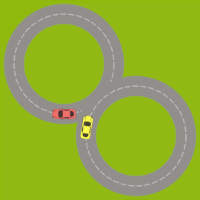
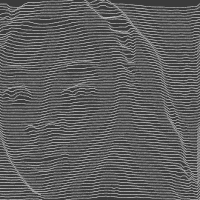

# Programmatic Animations with CCapture.js

Use code to make animated movies, using JavaScript and HTML Canvas. Export as WebM video files (not supported in Safari).

These examples use [CCapture.js](https://github.com/spite/ccapture.js) for capturing video frames.

## Examples

1. [Basic 2D canvas drawing](https://tomsoderlund.github.io/programmatic-animations-with-ccapture/01-basics/)  

2. [Basic physics](https://tomsoderlund.github.io/programmatic-animations-with-ccapture/02-basic-physics/) using [Matter.js](http://brm.io/matter-js/)  

3. [Advanced animation](https://tomsoderlund.github.io/programmatic-animations-with-ccapture/03-advanced-animation/) using [oCanvas](http://ocanvas.org)  

4. [Mouse position as input](https://tomsoderlund.github.io/programmatic-animations-with-ccapture/04-mouse/)  

5. [Image data](https://tomsoderlund.github.io/programmatic-animations-with-ccapture/05-image-data/)  

6. [Lines from image data](https://tomsoderlund.github.io/programmatic-animations-with-ccapture/06-lines/)  

## Share your work!

If you make your own animations based on these examples, please share with the hashtag [#programmaticanimations](https://www.instagram.com/explore/tags/programmaticanimations/).

## Learn more

- For more information on [how to draw with HTML Canvas, see this example](https://codepen.io/tomsoderlund/pen/Gdjrdx).
- You can use [VLC Media Player](https://www.videolan.org) to convert WebM to MP4 (File → Convert/Stream, MP4/MOV and MPEG-4 format).
